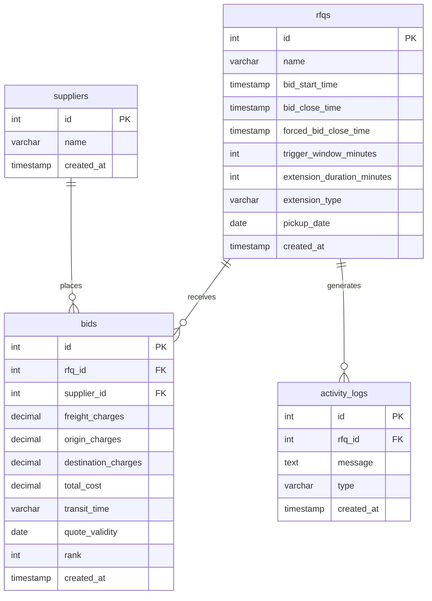

# Database Schema Design

This document outlines the detailed database schema for the RFQ British Auction Platform using PostgreSQL.

## Entity-Relationship Diagram

---

## 1. `suppliers`
Stores the profiles of the logistics companies/suppliers who will be placing bids on the platform.

| Column Name | Data Type | Constraints | Description |
| :--- | :--- | :--- | :--- |
| `id` | `SERIAL` | `PRIMARY KEY` | Unique auto-incrementing identifier. |
| `name` | `VARCHAR(255)` | `NOT NULL` | The official name of the supplier company. |
| `created_at` | `TIMESTAMP` | `DEFAULT CURRENT_TIMESTAMP` | When the profile was created. |

---

## 2. `rfqs`
The core table storing the configuration, timing, and rules for every Request for Quotation.

| Column Name | Data Type | Constraints | Description |
| :--- | :--- | :--- | :--- |
| `id` | `SERIAL` | `PRIMARY KEY` | Unique auto-incrementing identifier. |
| `name` | `VARCHAR(255)` | `NOT NULL` | The reference name or ID of the RFQ. |
| `bid_start_time` | `TIMESTAMP` | `NOT NULL` | The exact time when suppliers can begin bidding. |
| `bid_close_time` | `TIMESTAMP` | `NOT NULL` | The current scheduled closing time (can be extended). |
| `forced_bid_close_time` | `TIMESTAMP` | `NOT NULL` | The hard limit. The auction can **never** extend past this. |
| `trigger_window_minutes` | `INTEGER` | `NOT NULL, DEFAULT 10` | The final "X" minutes where triggers are active. |
| `extension_duration_minutes` | `INTEGER` | `NOT NULL, DEFAULT 5` | How many "Y" minutes to add if a trigger is hit. |
| `extension_type` | `VARCHAR(50)` | `NOT NULL` | The rule type: `BID_RECEIVED`, `RANK_CHANGE`, or `L1_CHANGE`. |
| `pickup_date` | `DATE` | `NOT NULL` | The physical date the cargo will be picked up. |
| `created_at` | `TIMESTAMP` | `DEFAULT CURRENT_TIMESTAMP` | When the RFQ was created. |

---

## 3. `bids`
Records every single bid placed by a supplier against a specific RFQ.

| Column Name | Data Type | Constraints | Description |
| :--- | :--- | :--- | :--- |
| `id` | `SERIAL` | `PRIMARY KEY` | Unique identifier for the bid. |
| `rfq_id` | `INTEGER` | `FOREIGN KEY (rfqs.id) ON DELETE CASCADE` | Which RFQ this bid belongs to. |
| `supplier_id` | `INTEGER` | `FOREIGN KEY (suppliers.id)` | Which supplier placed the bid. |
| `freight_charges` | `DECIMAL(10,2)` | `NOT NULL` | Cost of the main freight segment. |
| `origin_charges` | `DECIMAL(10,2)` | `NOT NULL` | Cost at the origin port/facility. |
| `destination_charges` | `DECIMAL(10,2)` | `NOT NULL` | Cost at the destination port/facility. |
| `total_cost` | `DECIMAL(10,2)` | `NOT NULL` | Calculated sum of freight + origin + destination. |
| `transit_time` | `VARCHAR(100)` | `NOT NULL` | Estimated transit duration (e.g., "5 Days"). |
| `quote_validity` | `DATE` | `NOT NULL` | Date until which the quote is valid. |
| `rank` | `INTEGER` | `NULL` | The calculated rank of the bid (1 = Lowest/L1). |
| `created_at` | `TIMESTAMP` | `DEFAULT CURRENT_TIMESTAMP` | The exact millisecond the bid was received. |

---

## 4. `activity_logs`
An audit trail used to populate the live "Terminal Feed" on the RFQ Details page. Tracks when bids are placed and when extensions occur.

| Column Name | Data Type | Constraints | Description |
| :--- | :--- | :--- | :--- |
| `id` | `SERIAL` | `PRIMARY KEY` | Unique identifier. |
| `rfq_id` | `INTEGER` | `FOREIGN KEY (rfqs.id) ON DELETE CASCADE` | Which RFQ the activity belongs to. |
| `message` | `TEXT` | `NOT NULL` | The formatted human-readable log message. |
| `type` | `VARCHAR(50)` | `NOT NULL` | Enum: `BID_PLACED` or `EXTENSION`. |
| `created_at` | `TIMESTAMP` | `DEFAULT CURRENT_TIMESTAMP` | When the event occurred. |

---

## Relationships & Integrity
* **Cascading Deletes**: If an RFQ is deleted, all associated `bids` and `activity_logs` are automatically deleted via `ON DELETE CASCADE` to prevent orphaned data.
* **ACID Compliance**: The Node.js backend handles `bids` insertion and `activity_logs` creation within a single SQL `BEGIN`/`COMMIT` transaction to ensure that the auction engine never falls out of sync.
