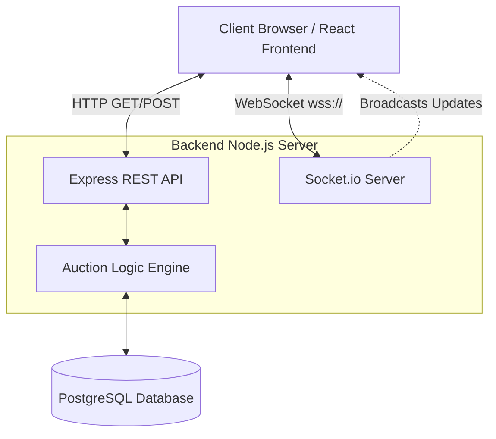
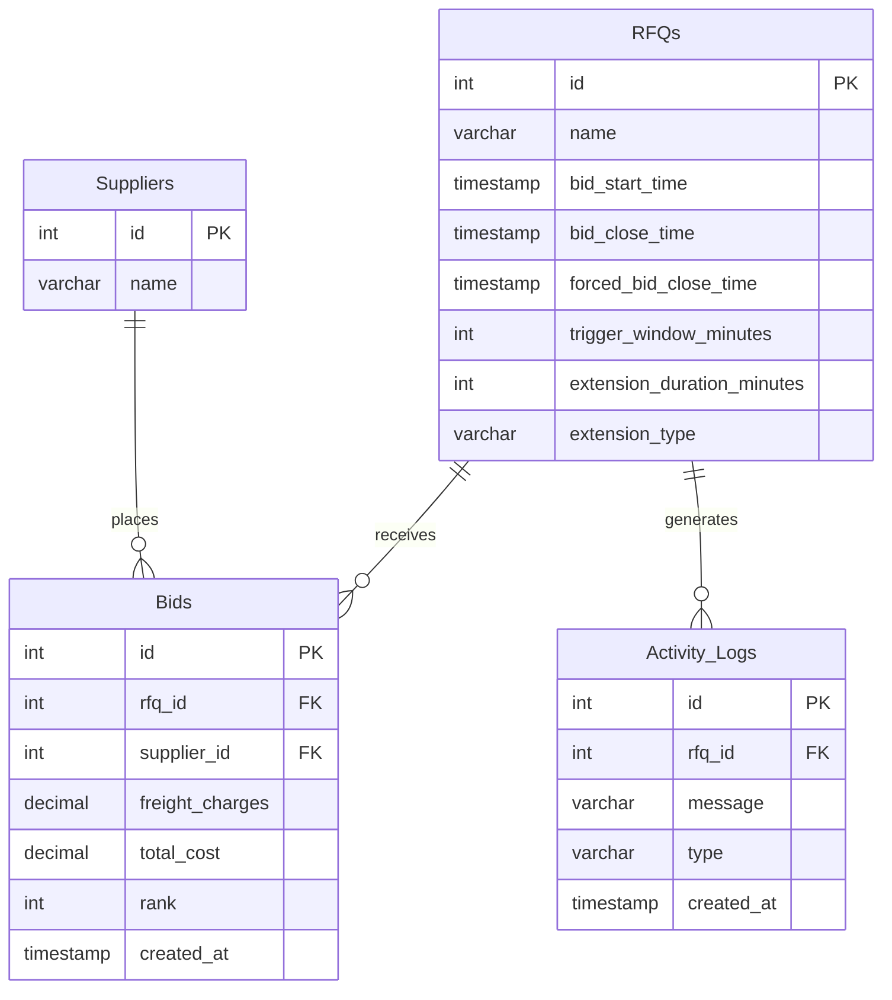
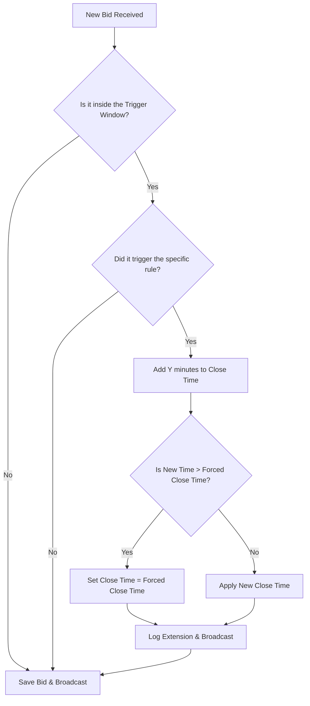
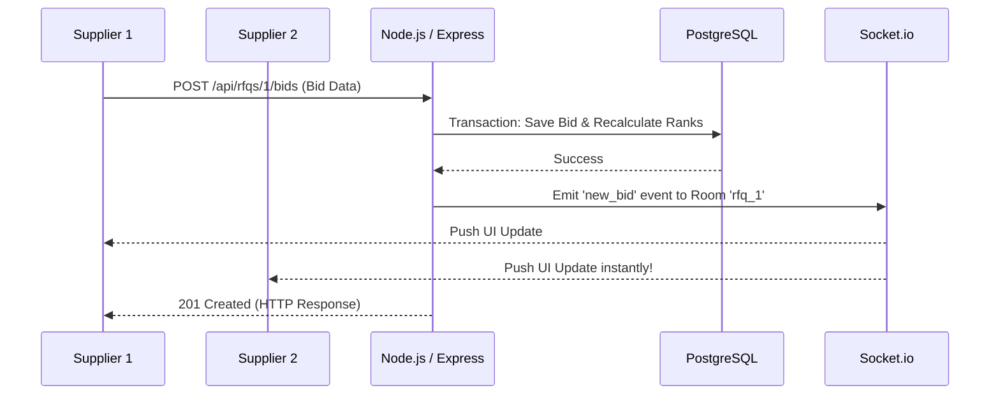

# High-Level Design (HLD) - Real-Time RFQ British Auction System

## 1. System Overview
The RFQ (Request for Quotation) Platform is a real-time, web-based bidding system designed for suppliers to compete for freight and shipping contracts. The platform utilizes a **British Auction mechanism**, meaning the lowest bid wins, and the auction automatically extends if specific conditions (triggers) are met near the closing time.

---

## 2. System Architecture

The system follows a classic 3-tier architecture with a specialized WebSocket layer for real-time synchronization.

### Components:
1. **Frontend Tier (React + Vite)**: Handles the UI, form validations, countdown timers, and live feed rendering. Uses `socket.io-client` for persistent connections.
2. **Application Tier (Node.js + Express)**: Handles API requests, coordinates database transactions, executes the Auction Extension logic, and pushes events to Socket.io.
3. **Data Tier (PostgreSQL)**: Persists RFQ data, Supplier profiles, Bids, and historical Activity Logs.

---

## 3. Database Schema (ER Diagram)

The relational database is designed for high data integrity during bidding wars, using Foreign Keys to maintain relationships.

---

## 4. The British Auction Extension Engine

The core complexity of the system lies in the `submitBid` controller. When a bid arrives, the system uses ACID database transactions (`BEGIN`, `COMMIT`, `ROLLBACK`) to prevent race conditions when multiple suppliers bid at the exact same millisecond.

### Logic Flow:

---

## 5. Real-Time Communication (WebSockets)

Instead of the frontend aggressively polling the backend every second (which overloads the server), the server selectively pushes data to clients only when something happens.

### Sequence Diagram: Bidding

**Room Architecture**:
Socket.io uses "Rooms" to segment traffic. If there are 10 different RFQs running, users looking at `RFQ #1` join room `rfq_1`. When a bid happens on `RFQ #1`, the server only broadcasts the update to users inside `rfq_1`, saving bandwidth.

---

## 6. API Design (RESTful)

*   `GET /api/rfqs` - Fetches all RFQs for the dashboard summary.
*   `POST /api/rfqs` - Creates a new RFQ configuration.
*   `GET /api/rfqs/:id` - Fetches detailed RFQ data, populated with nested Bids and Logs.
*   `POST /api/rfqs/:id/bids` - Submits a bid. Triggers the Auction Extension engine and WebSocket broadcasts.
*   `GET /api/suppliers` - Fetches the list of active suppliers for the dropdown.
